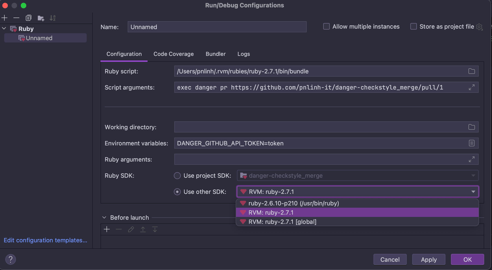

# danger-checkstyle_merge

A description of danger-checkstyle_merge.

## Installation
```sh
gem install danger-checkstyle_merge
```
Or
```ruby
source "https://rubygems.pkg.github.com/pnlinh-it" do
  gem "danger-checkstyle_merge", "0.0.1"
end
```

## Usage
```ruby
files = Dir['/Users/pnlinh/Desktop/Dev/Android/android-boilerplate/**/reports/ktlint/ktlintMainSourceSetCheck.xml']
output = 'ktlintMainSourceSetCheck.xml'
checkstyle_merge.merge(files, output)
```

## Development
- Use `exec danger local` in case already have PR
- Or use: `exec danger pr https://github.com/pnlinh-it/danger-checkstyle_merge/pull/1`
- 

1. Clone this repo
2. Run `bundle install` to setup dependencies.
3. Run `bundle exec rake spec` to run the tests.
4. Use `bundle exec guard` to automatically have tests run as you make changes.
5. Make your changes.
